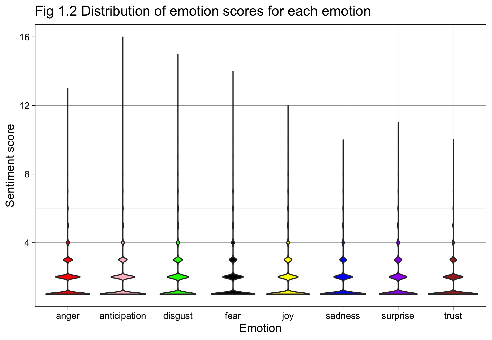

```{r setup, include=FALSE}
knitr::opts_chunk$set(echo = TRUE)
```


```{r, message=FALSE, warning=FALSE, include=FALSE}
packages.used=c("tidyverse", "syuzhet", "gridExtra")

# check packages that need to be installed.
packages.needed=setdiff(packages.used, 
                        intersect(installed.packages()[,1], 
                                  packages.used))
# install additional packages
if(length(packages.needed)>0){
  install.packages(packages.needed, dependencies = TRUE)
}

# load packages
library("tidyverse")
library("syuzhet")
library("gridExtra")

emo_types <- c("anger", "anticipation", "disgust", "fear", "joy",
               "sadness", "surprise", "trust")

# Include the functions wrote by me
source("../lib/DataProcessing.R")
source("../lib/PlotsAndExamples.R")
set.seed(20210929)
```

When it comes to philosophy, we tend to focus on philosophers' thoughts and beliefs about some fundamental questions, such as those about value, mind, and existence. However, we rarely pay attention to the emotions expressed in some masterpieces of philosophy. In this report, therefore, I aim at answering the following question: what emotions do some well-known philosophers express in their masterpieces? Are they more emotionally charged or neutral in their texts?

## 0. Dataset and Data Processing
```{r, message=FALSE, warning=FALSE, include=FALSE}
# Process the raw data
# It took me over an hour to get the sentiment scores so
# consider using the processed data directly
# data_file_path <- "../data/philosophy_data.csv"
# processed_data_path <- raw_data_proc(data_file_path)

# Get the top emotions for each sentence
processed_data_path <- "../output/sentence_list_emo.csv"
sentence_list <- processed_data_proc(processed_data_path)
```

The dataset use for analysis is the dataset compiled for [the Philosophy Data Project](http://www.philosophydata.com/). This dataset contains 59 masterpieces, written by 36 well-known philosophers from 13 schools of philosophy. This dataset has been extensively cleaned by its creator and it contains no missing values or abnormal inputs. So I perform no extra data cleaning on it.

As for sentimental analysis, I rely on [the NRC Emotion Lexicon](https://saifmohammad.com/WebPages/NRC-Emotion-Lexicon.htm). It is "a list of English words and their associations with eight basic emotions (anger, fear, anticipation, trust, surprise, sadness, joy, and disgust) and two sentiments (negative and positive)." I choose sentences as the unit for analysis since they are the natural units for organizing thoughts and expressing emotions. An emotion score, which represents the strength of a certain type of emotion, for each of the eight basic emotions, is assigned to each sentence with the *get_nrc_sentiment* function in the *syuzhet* package. For simplicity, I then assign the emotion with the highest emotion score as the emotion for that sentence. (If a sentence has multiple emotion score, one of them is chosen randomly as the emotion for that sentence.) In addition, I classify sentences with zero sentiment score across all eight emotions as emotionally neutral. 

## 1. Overall, what types of emotion are expressed in philosophy texts?

```{r, message=FALSE, warning=FALSE, include=FALSE}
# Generate the plots for this section.
plot1 <- get_plot1(sentence_list)
```

The overall emotions for all philosophers in the dataset are displayed in Fig1.1 below. It is surprising that only less than 30% of the sentences are emotionally neutral, which seems to contrast with the common impression that philosophy texts are plain, sophisticated and dull. In addition, trust, anticipation, and anger are the major type of emotion expressed in the philosophical texts, taking up over 40% of the overall sentences.


However, if we take a closer look at the distribution of the emotion score for each emotion, as shown in the Violin plot in Fig 1.2, all emotions, except for trust, has a emotion score of 1 for most sentences. In fact, about 40% of all sentences has a emotion score of 1 (the lower emotion score in my analysis). Hence, about 70% of sentences in the philosophical texts are emotional neutral or close to being neutral, which is more in line with our impression. It is worth noting that there are also some emotionally charged sentences with an emotional score over ten. So philosophers can get very emotionally charged in their texts, although such circumstances are very rare.


## 2. Are there any differences between philosopher in terms of emotional expression?

Despite the overall emotional neutrality, there are some major differences between the philosophers in terms of emotion expression. As shown in the two tables below, for example, only 10.55% of Wollstonecraft's sentences are emotionally neutral whereas 46.01% of Wittgenstein's sentences are neutral. Such huge differences can be explained by the different writing styles of the philosophers as well as the emotional states of the philosophers when they were writing the texts.
```{r, message=FALSE, warning=FALSE, echo = FALSE}
#Example in section
ex2 <- get_example2(sentence_list)
grid.arrange(tableGrob(ex2[[1]]), tableGrob(ex2[[2]]))
```

## 3. Do philosophers from different schools of philosophy tend to express different emotions? 
```{r, message=FALSE, warning=FALSE, include = FALSE}
# Generate the plots for this section.
plot3 <- get_plot3(sentence_list)
```
Different schools of philosophy can have very different or sometimes contradicting values and beliefs, so an interesting question is whether such differences influence the types of emotions expressed in the texts from various schools of philosophy.


As shown in Fig 3.1, the differences in terms of emotions are very mild across all 13 schools of philosophy. This suggests that on average, philosophers from different schools of philosophy tend to express the same types of emotion even when they are trying to elaborate very different thoughts or ideas.

## 4. Conclusion

* Although there are some highly emotionally charged sentences, the majority (70%) of sentences in the philosophical texts are emotional neutral or close to being neutral.
* Trust, anticipation, and anger are the major type of emotion expressed in the philosophical texts.
* There are some major differences between the philosophers in terms of emotional expression in their texts.
* On average philosophers from different schools of philosophy tend to express the same types of emotion even when they are trying to elaborate very different thoughts or ideas.

## 5. Caveats
There are some important caveats to be kept in mind about this report.

* For simplicity, I classify the emotion with the highest emotion score as the emotion for that sentence. This methodology ignores the subtlety of mixed emotions in a sentence. 
* Although the dataset is tidy, the accuracy of the philosophical texts cannot be guaranteed or verified by me. For example, without checking the original texts carefully, I cannot tell whether there is a typo in a certain sentence.
* The philosophers and texts included in the dataset might not be a representative sample. They are a very small subset of the population of all philosophers and all texts in philosophy. Moreover, it only includes philosophers in the West. Hence, strictly speaking, the conclusion of this report should only apply to the philosophers and texts covered in the dataset.
* Some of the texts are not written in English. (e.g. Plato and Aristotle certainly did not know English.) So the sentiment analysis based on English vocabulary depends highly on the quality of translation.

This notebook was prepared with the following environmental settings.

```{r}
print(R.version)
```
